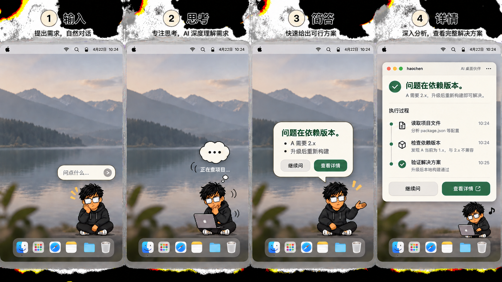

# haochen v0.3.0 交互与体验全面升级方案

> 状态：方案基线  
> 日期：2026-09-08  
> 目标版本：0.3.0  
> 核心方向：从“常驻聊天框”升级为“会说话、会做事、说完就退场的桌面伙伴”

## 1. 结论

v0.2.0 已经解决了大部分安全和稳定性地基问题，但产品表现仍然是“桌宠旁挂了一个缩小版聊天窗口”。v0.3.0 不应继续修饰现有长气泡，而应重构为两套明确分工的界面：

1. **桌面即时层**只负责输入、可理解的工作状态、必要确认和高密度简答；每个阶段短暂出现，完成后自动退场。
2. **完整会话层**负责详答、工具轨迹、历史、产物和连续追问；仅由用户主动展开。

用户发送后，输入框立刻消失。桌宠通过姿态、漫画气泡和真实任务阶段表达“我听到了、我在看、我在做、结果来了”。结果只显示一句结论、最多两个关键点和一个清晰的“查看详情”按钮；数秒后自动收起，只留下桌宠。

## 2. 调研范围与验证证据

本方案基于以下检查：

- 通读桌宠、气泡、完整窗口、对话协议、首启、权限、会话协调器和引擎扩展核心代码。
- `make check`：248 项测试全绿，整体覆盖率 81%。
- 重新运行桌宠 mock 场景：输入、思考、读屏确认、错误、打断、展开/收回、多屏几何与位置恢复全部通过。
- 使用 `/Applications/haochen.app` 和真实模型发送无敏感信息的普通问题，观察输入、思考、简答和详情展开全过程。
- 检查 v0.2.0 Release：DMG 可下载，HTTP 200；本地 DMG 与 Cask SHA-256 均为 `6fb99d0997386417f687b95c39ef4d94d30ea570f859a7bdb8e90dd50e5c1075`。

关键视觉证据：

- [当前气泡唤起](../../app/haochen_app/pet/verification/02-bubble-summoned.png)
- [当前思考状态](../../app/haochen_app/pet/verification/03b-bubble-thinking.png)
- [当前简答结果](../../app/haochen_app/pet/verification/06-read-screen-done.png)
- [当前详情窗口](../../app/haochen_app/pet/verification/09-detail-expanded-Esc.png)

设计原则参考 Apple 的官方建议：Popover 应只承载少量临时信息、尺寸只够内容使用，并在紧凑/展开切换时平滑过渡；文案应把最重要信息放前面、使用直接且行动导向的表达；动画应传达状态，同时在 Reduce Motion 下替换为淡化或颜色变化，而不是简单丢失状态语义。

- [Apple HIG: Popovers](https://developer.apple.com/design/human-interface-guidelines/popovers)
- [Apple HIG: Writing](https://developer.apple.com/design/human-interface-guidelines/writing)
- [Apple HIG: Buttons](https://developer.apple.com/design/human-interface-guidelines/buttons)
- [Apple: Reduced Motion evaluation criteria](https://developer.apple.com/help/app-store-connect/manage-app-accessibility/reduced-motion-evaluation-criteria/)

## 3. 当前体验审计

### 3.1 已经做对的部分

- 桌宠、气泡和完整窗口共享会话，没有形成两个割裂的聊天入口。
- 发送后输入区会先隐藏，思考、读屏、错误和完成已有状态信号。
- 气泡会锚定桌宠并处理多屏；详情能从气泡平滑展开，也能用 Esc 或 Command-W 收回。
- 引擎崩溃、消息队列、取消、重试和工具卡已有可靠性闭环。
- Keychain、私有目录、SSRF 防线和日志脱敏为后续体验升级提供了安全基础。

### 3.2 真实体验问题

| 优先级 | 问题 | 代码/实测依据 | 用户影响 |
| --- | --- | --- | --- |
| P0 | 完成后又显示完整输入框，整个 400px 气泡持续常驻 | `PetApp._on_summary_done()` 调用 `set_input_visible(True)`；真机可稳定复现 | 像聊天窗口，不像角色说话；遮挡当前工作 |
| P0 | L1 容器保存整段会话流，达到 70% 屏高后依赖滚动条 | `BubbleWindow` 的 `flow` 永不按轮次收敛，`_MAX_H_RATIO = 0.70` | 多轮后臃肿、抢占桌面、信息噪声不断累积 |
| P0 | 两步回答需要第二次模型请求 | `ConversationController` 在 answer 完成后发送 `haochen-summary-phase` | 增加延迟、成本和失败面；内部踢令占用会话上下文 |
| P0 | “结论先行”在详情页实际变成详答在前、短结在后 | `_on_summary_done()` 把 summary 追加在 answer 后 | 用户先读长文才能看到结论；同一信息出现两次 |
| P0 | 视觉回归只断言信号非空，截图第一帧可能只有“想好了 ✓”没有结果卡 | mock 场景结果截图与断言时序不同步 | 自动化全绿仍可能交付不可见结果 |
| P1 | 思考只是静态“正在想…”，三个姿态 PNG 仅淡入淡出 | `StatusBlock`、`PetWindow.set_pose()` | 没有漫画生命感，也无法判断是在看、查、执行还是整理 |
| P1 | mock 的正常短结包含协议标记和内部踢令，测试仍判定成功 | `04-summary-l1.png` 可见 `answer`、`haochen-summary-phase`、`summary` | 质量门禁没有覆盖“用户能否看懂” |
| P1 | 点击其他 App 不一定触发当前 Qt `eventFilter` | 过滤器只能收到本应用事件 | 文档声称“点气泡外收起”，实际跨 App 行为不可靠 |
| P1 | 详情窗口默认 1200×800，单轮内容只占顶部一小块 | 真机展开稳定复现 | 空白巨大、焦点分散、像开发工具而非精致会话详情 |
| P1 | 详情同时展示详答与短结，缺少明确标题和来源层级 | 真机展开显示两个相似的助手气泡 | 重复、难扫读，不清楚哪个是最终结论 |
| P1 | 桌宠右键菜单仍显示“设置（占位）” | `PetWindow.contextMenuEvent()` | 已完成的功能看起来仍是半成品 |
| P1 | 签名变化时启动代码会自动调用 `tccutil reset` | `reconcile_tcc_with_build()` | 用户权限可能被静默重置；应改为解释后由用户触发修复 |
| P1 | Homebrew 6 审计发现旧 `postflight` DSL 已弃用，且缺少 macOS 依赖声明 | `brew audit --cask --strict haochen` | 未来 Homebrew 更新后可能安装失败；治理提交已迁移到 `postflight_steps` |
| P2 | 主题 Token 在 pet/chat/settings 三处重复，暗色只是设置占位 | 三套 theme 模块、设置页 `_theme_card()` | 样式易漂移，无法真正跟随系统外观 |
| P2 | `chat/window.py`、`pet/bubble.py` 和 `pet/app.py` 过大 | 分别约 1082、697、560 行 | 状态、绘制和业务耦合，交互重构容易引发回归 |

## 4. 目标体验：“一句话出现，说完就退场”



> 视觉概念用于统一交互层级与节奏，不是最终像素级设计稿：前三阶段都是锚定桌宠的临时层，只有用户主动点击“查看详情”才打开完整窗口。

### 4.1 新状态模型

```text
IDLE
  └─ 双击/快捷键 → LISTENING（轻量输入条）
        └─ 发送 → ACK（收到，输入条立即消失）
              ├─ 需要授权 → NEEDS_ACTION（漫画确认卡，等待用户）
              └─ WORKING（姿态 + 真实阶段短句）
                    ├─ 看屏幕 PERCEIVING
                    ├─ 调工具 ACTING
                    └─ 整理结果 COMPOSING
                          ├─ RESULT（简答 + 查看详情）
                          ├─ ERROR（说清原因 + 下一步）
                          └─ CANCELLED（已停下，可恢复）

RESULT 无交互 8 秒 → IDLE
RESULT 点击“继续问” → LISTENING
RESULT 点击“查看详情” → DETAIL
```

状态必须由真实引擎事件驱动，不能伪造或展示模型隐藏思维。用户看到的是可验证的任务阶段，例如“正在读取 Safari 当前页面”“已经找到 3 个相关文件”“正在整理成两条建议”，而不是空泛的“深度思考中”。

### 4.2 分阶段界面

#### A. 输入：耳语条

- 双击桌宠后，从人物头顶弹出 320–380px 宽的单行/双行输入胶囊。
- 不显示标题栏、关闭按钮、会话历史或滚动条。
- Enter 发送；Command-Enter 换行；Esc 收起；输入自动保存为内存草稿。
- 发送后的 120ms 内，输入胶囊缩成一句“收到，我看一下”，随后消失。

#### B. 工作中：漫画思考泡

- 桌宠切到 `listening / looking / working / composing` 中对应的 sprite 动画。
- 人物头顶仅显示一个小型漫画思考泡，最多一行状态文案。
- 省略号三帧循环、眼睛朝当前窗口方向移动、读屏时出现短暂扫描高光；不展示大框。
- 工具超过 4 秒才显示更具体状态，避免快速任务闪烁多个阶段。
- 工作中可通过靠近桌宠或单击小泡显示“停止”按钮，平时不占空间。

#### C. 需要确认：明确行动卡

- 读屏、写文件、执行高影响操作时，展示不会自动消失的漫画确认卡。
- 标题直接说明动作：“要读取 Safari 当前页面”。
- 主按钮使用动词：“允许这次读取”；次按钮：“不读取”。避免“读吧/不读”在复杂权限场景中语义不够精确。
- 同一时间只显示一张确认卡，不在其上叠加其他气泡。

#### D. 结果：会说话的结论卡

```text
            ╭────────────────────────────╮
            │  是依赖版本冲突。           │  ← 24–60 字结论
            │  • A 要求 2.x，当前是 1.8   │  ← 最多 2 个要点
            │  • 升级后需要重新构建       │
            │          [继续问] [查看详情 ↗]│
            ╰───────────────────────▼────╯
                                  👓
```

- 宽 340–420px，高度按内容，但不出现滚动条。
- 只展示当前这一轮，不回放用户消息和过去结果。
- 结论必须独立成句；最多两个有信息量的要点；总长度建议 60–140 个中文字符。
- `查看详情` 是有底色、有图标、有 hover/pressed/focus 状态的主操作，不再是文本链接。
- 结果进入时按“结论 → 要点 → 操作”分三拍出现，形成漫画对白节奏。
- 8 秒无交互淡出；鼠标悬停、键盘焦点或 VoiceOver 朗读时暂停倒计时。
- 设置提供 3 秒、8 秒、手动关闭三档；默认 8 秒。
- 自动消失后，在桌宠旁保留 2 秒小圆点提示“有新结果”，单击可重新打开上一条简答。

#### E. 错误：先给恢复办法

错误卡只回答三件事：发生了什么、是否影响已经完成的工作、下一步点什么。示例：

> 模型额度用完了，这次没有生成结果。充值后点“重试”，或者到设置里换一个模型。

不要只显示 HTTP 状态码或“模型服务不可用”。

## 5. 回答质量：“人话 + 清晰结论 + 信息密度”

### 5.1 废除第二次 summary 模型回合

把当前 `answer → 再请求 summary` 改为单回合结构化结果：

```text
【brief】
一句结论。
- 关键点一
- 关键点二
【/brief】
【detail】
完整依据、操作过程、代码、产物和下一步。
【/detail】
```

引擎完成工具调用后一次生成 `brief + detail`；UI 解析后：

- L1 只渲染 `brief`。
- L2 先渲染 `brief`，再以“依据与过程”展示 `detail`。
- 会话只保存一组用户/助手消息，不再插入内部 summary 踢令。
- 标记异常时优先从 detail 本地提取首个有效结论，并记录脱敏诊断，不再追加第二次网络请求。

预期直接减少一次模型往返、一次失败机会和一组上下文消息。

### 5.2 简答内容契约

简答不是“把详答压缩到 160 字”，而是一个可操作的判断：

1. 第一行必须回答用户真正问的是什么。
2. 要点只保留证据、影响、数字、文件名或下一步；禁止泛泛的“需要注意”“建议优化”。
3. 能给明确判断就不用“可能、通常、一般来说”连续降级。
4. 不复述问题，不描述自己调用了什么工具，不出现协议词、模型词或元评论。
5. 没有可执行下一步时不强行给建议；有阻塞时明确说需要用户做什么。
6. 闲聊可只用一两句自然语言，不强制列点。

推荐的内部数据结构：

```python
TurnResult(
    headline="这是依赖版本冲突。",
    bullets=["A 要求 2.x，当前环境是 1.8", "升级后重新构建即可"],
    detail_markdown="…",
    next_action=Action(label="打开项目", kind="open_file", target="…"),
    confidence="confirmed",
)
```

结构化对象由协议解析器统一生成，pet 与 chat 不再各自拼接文本。

### 5.3 文案风格

- 使用“我看到了……”“问题在……”“你现在只需要……”等直接表达。
- 技术问题先判断，再用证据解释；闲聊像熟悉的伙伴，不套技术报告模板。
- 状态文案长度不超过 16 个中文字符，按钮使用动词。
- 把“展开详细”改为“查看详情”；把“想好了 ✓”改为结果入场动画，不长期占一行。
- 用户可在设置选择“极简 / 标准 / 详细”，但默认使用标准，不能让用户先调教才好用。

## 6. 视觉与动效系统

### 6.1 角色资产

从 3 张静态 PNG 升级为可复用 sprite sheet：

- 现有 `idle / thinking / angry` 是角色身份基准：成年工程师气质、黑色连帽衫、侧扫黑发、银白反光矩形眼镜、暖橙肤色和克制表情必须保持。
- 全身化只扩展身体、动作和道具，不重画角色身份；头身比例应接近成年像素人物，避免幼态圆脸、腮红、眨眼卖萌、夸张庆祝和绿色毛衣等形象漂移。
- 动作可以有漫画表现力，但情绪表达以“可靠、专注、有一点幽默”为准，不走卡哇伊吉祥物路线。

| 状态 | 建议帧数 | 表现 |
| --- | ---: | --- |
| idle | 8 | 呼吸、眨眼、轻微重心变化 |
| listening | 6 | 身体前倾、耳侧提示 |
| looking | 8 | 眼睛朝窗口方向、镜片扫描光 |
| working | 10 | 敲键盘/翻页，不假装展示思维 |
| composing | 6 | 抬头、整理纸张/卡片 |
| presenting | 6 | 伸手指向结果气泡 |
| alert | 6 | 明确但不夸张的警示动作 |
| success | 6 | 轻点头，不使用持续庆祝动画 |

默认 8–12 FPS；鼠标拖动时暂停复杂动画。Reduce Motion 开启时每个状态使用一张静态关键帧，并通过图标、颜色和文字保留状态语义。

### 6.2 统一 Token

合并 pet/chat/settings 三套主题，建立单一 `DesignTokens`：颜色、字阶、间距、圆角、阴影、动画时长、焦点环和高对比度映射均从一处读取。

- 浅色继续保留暖米白，但降低整页黄度，内容卡用更中性的表面色。
- 增加真正的系统暗色映射，而不是设置占位。
- 主描边从全局 2px 改为分层使用：漫画结果 2px，普通内容卡 1px，状态泡无描边。
- 正文 15px / 1.55，简答标题 16px / 1.4，状态 12–13px。
- 所有交互控件具备 hover、pressed、focus-visible、disabled 四态。

### 6.3 动画预算

- 输入出现：160ms spring-like scale + fade。
- 输入收束为 ACK：120ms。
- 工作状态切换：180ms crossfade；短任务不闪阶段。
- 结果入场：整体 180ms，内容 stagger 总时长不超过 360ms。
- 自动退场：140ms fade + 4px 下沉。
- 从结果到详情：220ms 几何与透明度联动。

任何持续循环动画必须可以停止；CPU 空闲占用和窗口不透明刷新要纳入性能测试。

## 7. 详情工作台重做

详情不是放大气泡，而是当前任务的可审计记录：

- 默认宽度 840–980px，高度随屏幕和内容，避免单轮直接铺满 1200×800。
- 顶部固定“结论”区，一句话 + 关键点 + 相关产物。
- 下方为“依据与过程”，包括完整 Markdown、工具调用和错误/重试。
- 工具卡按时间线折叠，默认只显示动作、结果和耗时；失败项自动展开。
- 单轮详情打开时侧栏自动折叠；用户主动打开完整 App 时恢复会话侧栏。
- 输入框固定底部但高度紧凑，提供“继续这个话题”的明确占位。
- 用户从结果卡展开后，Esc/Command-W 回到桌宠，但不会让已自动消失的旧结果重新常驻。

## 8. 架构改造

### 8.1 新增 PresentationCoordinator

把当前 `PetApp` 同时负责引擎、队列、状态、气泡和详情跳转的职责拆开：

```text
EngineClient / SessionCoordinator
            │ domain events
            ▼
TurnController ──► TurnResult
            │
            ▼
PresentationCoordinator
   ├─ PetAnimator
   ├─ TransientBubbleController
   └─ DetailPresenter
```

- `TurnController`：处理单回合协议、工具事件、取消和最终结构化结果。
- `PresentationCoordinator`：只决定当前展示形态、超时和跨窗口切换。
- `TransientBubbleController`：管理输入、状态、确认、结果四种互斥视图。
- `PetAnimator`：状态到 sprite/Reduce Motion 关键帧的映射。
- `DetailPresenter`：把同一个 `TurnResult` 渲染到 L2。

禁止 UI 直接访问 `supervisor._restarting`、`bubble._refresh_height()`、`chat._new_session()` 等私有成员；补齐公开命令与只读状态。

### 8.2 小组件拆分

- `pet/input_bubble.py`
- `pet/progress_bubble.py`
- `pet/action_bubble.py`
- `pet/result_bubble.py`
- `pet/animator.py`
- `presentation/coordinator.py`
- `conversation/result_protocol.py`
- `design/tokens.py`

目标是核心窗口/协调文件单文件不超过约 400 行，绘制、状态和业务测试可以独立运行。

### 8.3 macOS 行为

- 使用原生窗口失活通知或事件监听实现跨 App 的可靠收起，不依赖只覆盖本应用事件的 Qt event filter。
- 自动关闭只作用于非模态结果；确认卡、错误恢复和用户正在编辑的输入永不自动丢失。
- 删除启动时自动 `tccutil reset`；只有检测到失效并向用户解释后，用户点击“重置授权”才执行。
- 正式版完成 Developer ID 签名和公证，移除 Cask 的 quarantine 绕过。

## 9. 测试与质量门禁

### 9.1 自动化状态测试

为每一条状态迁移建立表驱动测试，覆盖：

- 快速成功、慢任务、多工具、读屏确认、拒绝、错误、取消、崩溃恢复。
- 结果倒计时、hover 暂停、键盘焦点暂停、重新打开上一结果。
- 结果自动退场时详情仍可从菜单和完整窗口查看。
- 双入口并发排队、会话切换和重启后不重复发送。

### 9.2 视觉回归

截图前必须等待以下三项同时成立：状态终结、布局稳定、目标控件在 viewport 内可见。新增像素/结构断言：

- 结果卡包含非空 headline，且没有 `answer`、`summary`、`haochen-summary-phase` 等协议词。
- L1 没有滚动条、标题栏和常驻输入框。
- 结果卡不超过屏幕可用区，尾巴指向桌宠且不遮挡桌宠。
- 中英文长句、代码、Emoji、200% 缩放和多屏均不裁切。
- Light、Dark、Increase Contrast、Reduce Transparency、Reduce Motion 全部截图验收。

### 9.3 真机体验回归

每个候选版本至少完成：

1. 干净安装、升级安装、卸载重装。
2. 无权限、只给辅助功能、完整权限三种路径。
3. 单屏、外接屏、拔屏、全屏 App 与 Stage Manager。
4. 键盘全流程和 VoiceOver 朗读顺序。
5. 10 分钟连续对话、50 轮会话、长任务取消、引擎崩溃。
6. 一台无开发环境的 Mac 上通过 Homebrew 安装和 Gatekeeper 验证。

### 9.4 性能指标

| 指标 | 目标 |
| --- | ---: |
| 唤起到可输入 P95 | ≤ 250ms |
| 发送到输入框消失 | ≤ 120ms |
| 引擎首个状态反馈 P95 | ≤ 300ms |
| UI 主线程最长卡顿 P95 | < 50ms |
| 结果卡布局稳定 | ≤ 2 帧 |
| idle CPU | < 1% |
| idle 内存 | 建立 v0.2.0 基线后不增长超过 10% |
| 50 轮后窗口/动画对象泄漏 | 0 |

## 10. 版本拆分与实施顺序

### v0.2.1：可靠性与门禁修复

- 修正视觉测试等待条件和坏 mock 短结，协议词泄露必须失败。
- 删除启动自动重置 TCC，改为用户主动修复。
- 修复右键菜单“设置（占位）”、跨 App 失活和已确认的窗口生命周期问题。
- 完成统一 Cask 路径、CI、发布和仓库治理。
- Cask 迁移到 Homebrew 6 的 `postflight_steps`，补充 macOS 依赖声明并通过严格审计。

### v0.3.0-dev.1：单回合结果协议

- 引入 `TurnResult` 与 `brief/detail` 单回合协议。
- 迁移 L1/L2 渲染，删除第二次 summary 请求。
- 增加协议污染、降级提取和上下文体积测试。

### v0.3.0-beta.1：漫画式临时交互

- 四种互斥气泡、结果自动退场、继续问与重新打开上一结果。
- 新 sprite 动画、真实阶段映射、Reduce Motion 关键帧。
- 真机完成跨 App、多屏、长文本和权限卡测试。

### v0.3.0-rc.1：详情与视觉收口

- 详情页结论优先、工具时间线、紧凑模式。
- 统一主题 Token、系统暗色、高对比度与 VoiceOver。
- 性能、50 轮耐久、安装升级和发布候选回归。

### v0.3.0：正式发布

- Developer ID + Notarization + Staple。
- 移除 Cask quarantine 绕过。
- Release Notes 提供交互演示录屏、校验和与回滚说明。

## 11. v0.3.0 验收定义

以下条件全部满足才算完成：

- 用户发送后不再留下常驻输入框或长聊天面板。
- 工作中能看懂真实阶段，但看不到模型隐藏思维和内部协议。
- 最终简答第一句就是结论，最多两个高信息量要点，默认 8 秒自动退场。
- “查看详情”按钮明显、可键盘操作，展开后先看到同一结论，再看到依据与工具过程。
- L1 与 L2 使用同一个结构化结果，不重复请求模型、不重复存储 summary 踢令。
- 读屏确认、错误恢复和用户输入不会因自动退场而丢失。
- Light/Dark、Reduce Motion、VoiceOver、多屏、崩溃恢复和 Homebrew 安装全部通过。
- 所有 CI、自动化、视觉回归和真机验收有可追溯证据。

## 12. 后续方向

完成 v0.3.0 后再进入“万能桌面宠物”的主动能力阶段：根据用户明确开启的规则观察任务进度、在完成或需要确认时轻提醒、提供可撤销的快捷动作。主动能力必须建立在不偷看、不频繁打扰、可解释、可关闭的前提上；不应在当前即时交互尚未达到顺滑标准前扩张。
